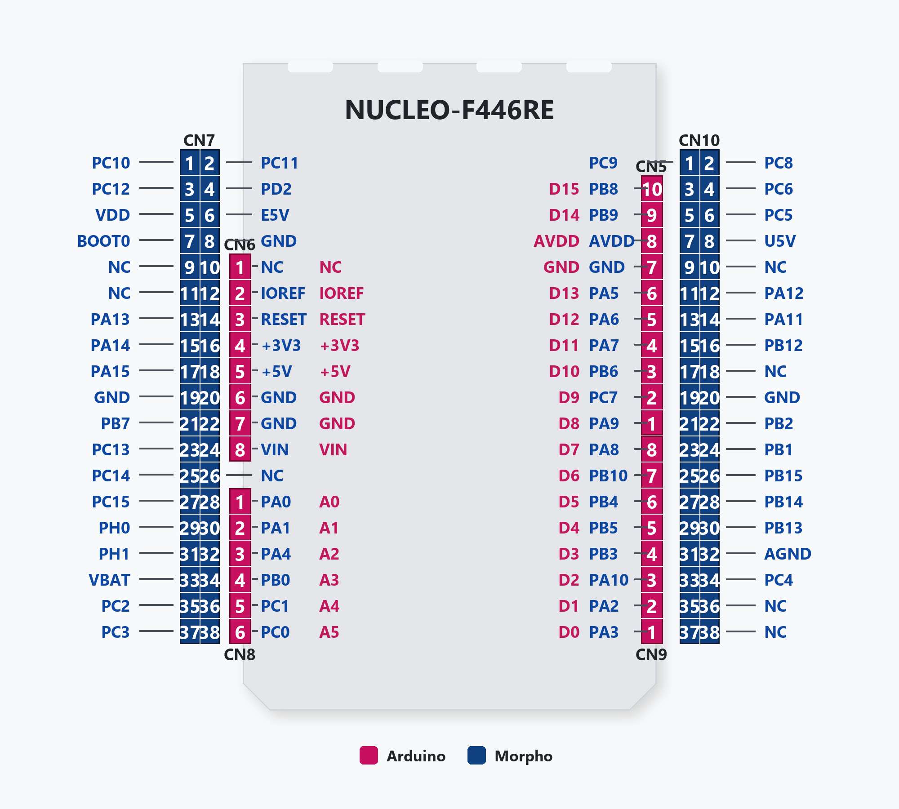

# STM32-CAN-Bridge

Triple protocol gateway on Nucleo-F446RE: **UART ↔ CAN ↔ Modbus RS-485**
with SSD1306 OLED display. Compatible with PicoCANBridge / PicoCANGui / SonoPilotModbus.

## Hardware

- **Board:** Nucleo-64 STM32F446RE (Cortex-M4 180MHz)
- **CAN:** CAN1 HW peripheral + SN65HVD230 transceiver
- **Modbus:** USART1 RS-485 master + DE pin (MAX485/SN75176/ETT Mini 422/485)
- **UART:** USART2 via ST-Link VCP (USB COM port ในตัว)
- **OLED:** SSD1306 128×64 I2C, DMA double buffer
- **LED:** PA5 — activity blink

## Pin Map

### STM32 → Arduino Header (Nucleo-F446RE)



| Function | STM32 Pin | Arduino Pin | Morpho Pin | หมายเหตุ |
|----------|-----------|-------------|------------|----------|
| USART2 TX (VCP) | PA2 | D1 | CN9-35 | ST-Link VCP (ต่อให้แล้ว) |
| USART2 RX (VCP) | PA3 | D0 | CN9-37 | ST-Link VCP (ต่อให้แล้ว) |
| I2C1 SCL (OLED) | PB8 | **D15** | CN5-10 | ตามที่พิมพ์บนบอร์ด |
| I2C1 SDA (OLED) | PB9 | **D14** | CN5-9 | ตามที่พิมพ์บนบอร์ด |
| CAN1 RX | PA11 | — | CN10-14 | ต่อ SN65HVD230 RXD |
| CAN1 TX | PA12 | — | CN10-12 | ต่อ SN65HVD230 TXD |
| Modbus TX | PA9 | **D8** | CN5-21 | USART1 → RS-485 transceiver |
| Modbus RX | PA10 | **D2** | CN9-33 | USART1 ← RS-485 transceiver |
| RS-485 DE | PA8 | **D7** | CN5-21 | direction enable |
| LED | PA5 | **D13** | CN10-11 | LED บนบอร์ด |
| User Button | PC13 | — | CN7-23 | กดติดดิน |

## Wiring Diagram

```
Nucleo F446RE          SN65HVD230 (CAN)       RS-485 Transceiver     SSD1306 OLED
  PA12 (CAN1_TX) ─────── TXD
  PA11 (CAN1_RX) ─────── RXD
  3V3 ────────────────── VCC
  GND ────────────────── GND
                          CANH ──── CAN Bus
                          CANL ──── CAN Bus

  D8/PA9  (Modbus TX) ──────────────────────── DI/TX
  D2/PA10 (Modbus RX) ──────────────────────── RO/RX
  D7/PA8  (DE) ────────────────────────────── DE+RE
  3V3 ─────────────────────────────────────── VCC
  GND ─────────────────────────────────────── GND
                                               A+ ──── RS-485 Bus
                                               B- ──── RS-485 Bus

  D15/PB8 (I2C1_SCL) ──────────────────────────────────────────── SCL
  D14/PB9 (I2C1_SDA) ──────────────────────────────────────────── SDA
                                                                   VCC ── 3V3
                                                                   GND ── GND

  [USB] ST-Link ←→ PC (COM port อัตโนมัติ)
  [D13/PA5] LED กระพริบ = bridge ทำงาน
```

### Dual-bus on Cat5e/Cat6 cable

```
RJ45 Pin Allocation:
  Pin 1,2 (pair 1) → CAN H / CAN L
  Pin 3,6 (pair 2) → RS-485 A / B
  Pin 4,5 (pair 3) → GND (shared)
  Pin 7,8 (pair 4) → spare / VCC (optional remote power)
```

## Protocol

### Bridge Commands (PC ↔ STM32 via UART)

| Cmd | Direction | Format | Description |
|-----|-----------|--------|-------------|
| `0x01` | PC → Bridge | `[0x01, ID_H, ID_L, DLC, data...]` | ส่ง CAN frame |
| `0x02` | Bridge → PC | `[0x02, ID_H, ID_L, DLC, data...]` | รับ CAN frame |
| `0x03` | PC → Bridge | `[0x03, len, raw_modbus_frame...]` | ส่ง Modbus RTU (pass-through) |
| `0x04` | Bridge → PC | `[0x04, len, raw_modbus_frame...]` | รับ Modbus response |

Transport: UART 115200 8N1 ผ่าน ST-Link VCP

### CAN ↔ Modbus Auto-translate

Bridge แปลง CAN command เป็น Modbus FC06 อัตโนมัติ:

| CAN Command | → Modbus Write |
|-------------|----------------|
| `0x100+N` data=[0x01, 0] Play | FC06 slave N, reg 0x0010 = 1 |
| `0x100+N` data=[0x02, 0] Stop | FC06 slave N, reg 0x0010 = 2 |
| `0x100+N` data=[0x03, 0] Next | FC06 slave N, reg 0x0010 = 3 |
| `0x100+N` data=[0x04, 0] Prev | FC06 slave N, reg 0x0010 = 4 |
| `0x100+N` data=[0x05, 0] Pause | FC06 slave N, reg 0x0010 = 5 |
| `0x100+N` data=[0x06, vol] Volume | FC06 slave N, reg 0x0003 = vol |
| `0x100+N` data=[0x07, mode] Repeat | FC06 slave N, reg 0x0004 = mode |
| `0x100+N` data=[0x10, 0] GET | FC03 slave N, read status → CAN 0x300+N |

### GUI Compatibility

| GUI | Connection | Mode |
|-----|-----------|------|
| **PicoCANGui** | USB HID → PicoCANBridge | CAN only (0x01/0x02) |
| **SonoPilotModbus** | Serial COM direct | Modbus direct (NModbus4) |
| **SonoPilotModbus** | Serial COM → STM32 Bridge | ติ๊ก "Bridge" checkbox (0x03/0x04) |

## Modbus RS-485

- **USART1** 115200 8N1 (configurable)
- **Master mode** — STM32 poll SonoPilot slave nodes
- **DE pin** PA8 toggle TX/RX direction
- **CRC16** software (Modbus polynomial 0xA001)
- **3.5-char silence detection** via DWT cycle counter
- **Modbus register map** → see [docs/MODBUS_PROTOCOL.md](docs/MODBUS_PROTOCOL.md)

## CAN Bus

- **CAN1** HW peripheral (ไม่ใช่ PIO — ไม่มีปัญหา AHB bus contention กับ audio)
- **Baud rate** configurable: 125k / 250k / 500k / 1M
- **HW filter** accept all (mask=0)
- **HW RX FIFO** 3-deep + IRQ → ring buffer → task drain
- **Auto bus-off recovery** enabled
- **CAN protocol** → see [docs/CAN_PROTOCOL.md](docs/CAN_PROTOCOL.md)

### CAN Baud Rate

| Index | Baud | Prescaler | หมายเหตุ |
|-------|------|-----------|----------|
| 0 | 125k | 24 | default, สายยาว 200m+ |
| 1 | 250k | 12 | |
| 2 | 500k | 6 | |
| 3 | 1M | 3 | สายสั้น < 10m |

APB1 = 45MHz, BS1=12TQ, BS2=2TQ, SJW=1TQ (15 TQ per bit)

## OLED Display

- SSD1306 128×64, I2C1 400kHz
- DMA double buffer (เหมือน Pico version)
- Draw to back buffer → swap → DMA transfer (~23ms)
- FreeRTOS task draws freely ระหว่าง DMA ทำงาน

## Architecture

```
                         FreeRTOS
                        ┌───────────────────────────────┐
                        │  task_bridge                  │
  ST-Link VCP ◄─────────┤  0x01/0x02: UART ↔ CAN       │
  (USB COM)   ─────────►│  0x03/0x04: UART ↔ RS-485    │
                        │  CAN → Modbus auto-translate  │
                        │  OLED update @ 30fps          │
                        └───────────────────────────────┘
                          │          │          │
                     CAN1 HW    USART1+DE   I2C1+DMA
                    (PA11/PA12) (PA9/PA10)  (PB8/PB9)
                          │          │          │
                    SN65HVD230   RS-485    SSD1306
                          │     transceiver     
                     CAN Bus    RS-485 Bus
                          │          │
                    ┌─────┴──────────┴─────┐
                    │  SonoPilot Nodes      │
                    │  (Pico 2 + audio)     │
                    └──────────────────────┘
```

## Build & Flash

**VS Code:** กด **`Ctrl+Shift+B`** = build + flash ทีเดียวจบ

**Manual:**
```bash
cmake -B build -G Ninja -DCMAKE_TOOLCHAIN_FILE=cmake/gnu-tools-for-stm32.cmake -DCMAKE_BUILD_TYPE=Debug
cd build/Debug && ninja
STM32_Programmer_CLI -c port=SWD -w STM32-CAN-Bridge.bin 0x08000000 -v -rst
```

## Port to STM32F103 (Blue Pill)

| เปลี่ยน | F446RE | F103C8 |
|---------|--------|--------|
| Startup | startup_stm32f446xx.S | startup_stm32f103xb.S |
| Linker | stm32f446xe_flash.ld | stm32f103c8_flash.ld |
| Clock | 180MHz (HSE 8MHz) | 72MHz (HSE 8MHz) |
| APB1 | 45MHz | 36MHz |
| CAN prescaler | 24/12/6/3 | 18/9/4/2 |
| CAN pins | PA11/PA12 | PA11/PA12 (เหมือนกัน) |
| I2C pins | PB8/PB9 | PB6/PB7 |
| CAN+USB | ใช้พร้อมกันได้ | share SRAM — config filter bank offset |
| HAL API | เหมือนกัน | เหมือนกัน |

## Related Repos

| Repo | Purpose |
|------|---------|
| [rp2350-mp3-player](https://github.com/fildsady/sonopilot-firmware) | SonoPilot firmware (Pico 2) |
| [SonoPilotModbus](https://github.com/fildsady/SonoPilotModbus) | PC GUI (Modbus + Bridge mode) |
| [PicoCANBridge](https://github.com/fildsady/PicoCANBridge) | USB HID-CAN bridge (Pico) |
| [PicoCANGui](https://github.com/fildsady/PicoCANGui) | CAN GUI (PC) |
